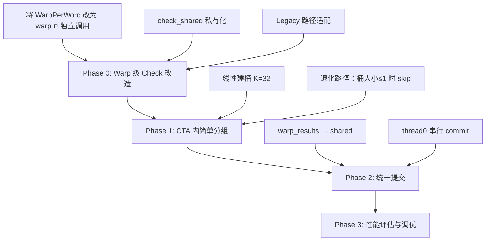

# FQ-PT-CID-CTA-MB 方案技术评审

> 对 `SACGPU_new.md` 提出的 **CID CTA Micro-Batch（Warp-per-World, lane→word）** 方案，结合现有代码实现的独立技术评审。

---

## 一、方案概述与定位

该方案是对当前 FQ-PT Baseline（`FQPTBaselineKernel`）的下一步优化：从"每个 CTA 一次只处理一个 `(world, cid)` 任务"升级到"CTA 内按 `cid` 分组、多个 warp 并行处理同 `cid` 的不同 world"。

**核心思路**：

1. CTA 从队列批量 pop K 个 `(world, cid)` 任务
2. CTA 内按 `cid` 分组（group-by）
3. 每组内 `WARPS_PER_CTA` 个 warp 并行处理不同 world
4. 每个 warp 内 lane→word 保持 bitSubDom 合并访问

---

## 二、对方案设计的评价

### 2.1 ✅ 合理的设计决策

#### bitSubDom 合并访问策略正确

文档选择 **warp→world, lane→word** 的映射是完全正确的。从代码看：

```cpp
// GModel.cu:1932 - 当前 WarpPerWord 已经是这种模式
for (int word = warp_id; word < model.bit_dom_int_size; word += num_warps) {
    const int value = word * 32 + lane_id;
    // ...
}
```

当前的 `ExecuteConstraintCheck_BpC_Workspace_WarpPerWord` 已经在用 warp-per-word 策略，新方案只需将其从"block 内所有 warp 处理同一个 world"改为"每个 warp 独立处理一个 world"，逻辑复用度高。

#### 保持单点提交避免 multi-producer

这个决策非常明智。现有 FQ-PT kernel 的后继任务生成逻辑（行 2803-2843）已经比较复杂，涉及 `FQPTTryMarkConstraintQueued` + `FQPTFlushGeneratedBuffer` + overflow 处理。如果让多个 warp 并行生成后继，会导致 `local_gen` buffer 变成 multi-producer，引入竞争和正确性风险。

#### 不改全局 bitSubDom 布局

务实选择。转置 bitSubDom 布局是高收益但高成本的改动，涉及 **所有现有 kernel（Batch-1/2/3A/FQ-PT）** 的适配。在当前阶段保持布局不变、在 CTA 内局部优化是更稳妥的路径。

---

### 2.2 ⚠️ 需要注意的问题

#### 问题 1：check_shared 私有化的 shared memory 压力

文档建议 `check_shared_per_warp[WARPS_PER_CTA][check_words]`。从代码看：

```cpp
// GModel.cu:2630
const int check_words = 2 * model.bit_dom_int_size + 16;
```

以 `WARPS_PER_CTA=8, bit_dom_int_size=4`（128 位域）为例：

| 资源 | 用量 |
|------|------|
| check_shared | 8 × (2×4+16) × 4 = **768 bytes** |
| local_pop | K × sizeof(FQPTTask) |
| local_gen | K × sizeof(FQPTTask) |
| local_retry | K × sizeof(FQPTTask) |
| 分组相关 | unique_cid + world_list |

如果 K=64, `sizeof(FQPTTask)`=8，仅 buffer 就需 64×8×3 = **1536 bytes**。加上分组数据结构，shared memory 总量可能达到 **3-4 KB**。

> [!IMPORTANT]
> Jetson Orin 每个 SM 只有 **48 KB** shared memory。如果单 block 占用过多 shared memory，会**大幅降低 block 驻留数**（occupancy），反而抵消并行收益。建议 K 从 32 起步，并用 `cudaOccupancyMaxActiveBlocksPerMultiprocessor` 评估。

#### 问题 2：`ExecuteConstraintCheck_BpC_Workspace` 的 warp 化改造不简单

当前的两个实现（Legacy / WarpPerWord）都**隐含了 block 级同步依赖**：

```cpp
// GModel.cu:1929 - WarpPerWord 版本中
__syncthreads();  // 初始化 shared_mem 后的同步
// ...
__syncthreads();  // 归约完成后的同步
```

要改造为"warp 可独立调用"版本，需要：

1. **将 `__syncthreads()` 替换为 `__syncwarp()`**
2. **将 shared 写回逻辑从 `threadIdx.x == 0`（block 级 thread0）改为 `lane_id == 0`（warp 级 lane0）**
3. **确保 warp_del_x/y 等中间结果用 warp 私有 shared 区域**，不再是块级共享

当前 WarpPerWord 版本中：
- `warp_del_x/warp_del_y` 是 block 共享的（行 1921-1922）
- `new_dom_x/new_dom_y` 也是 block 共享的（行 1919-1920）
- 最终写回由全局 `threadIdx.x == 0` 完成（行 1994）

这些都需要重构为 per-warp 版本。**工作量不算小**，但方向是对的。

#### 问题 3：CTA 内分组的额外延迟

方案 A（线性建桶）在 K=128 时需要 O(K²) 比较操作（最坏情况），这全部在单个 CTA 的 thread0 上执行。如果任务中 `cid` 高度分散（每个 cid 只出现 1-2 次），分组几乎没有收益，但开销仍然存在。

> [!TIP]
> 建议增加一个 **自适应退化路径**：如果分组后最大桶大小 ≤ 1，则跳过 micro-batch 逻辑，直接退化为现有的逐任务处理模式。这避免了最坏情况下的性能退化。

#### 问题 4：world_lock 冲突在 micro-batch 下可能加剧

当前 FQ-PT kernel 中一个 block 一次只持有一个 world_lock。micro-batch 后，一个 CTA 可能同时需要获取 `WARPS_PER_CTA` 个不同的 world_lock（同一 cid 的不同 world）。虽然同 cid 不同 world 的 lock 大概率不冲突，但如果多个 CTA 同时处理重叠的 world 集合（例如通过不同 cid），lock 争用会增加。

文档已预留了 RETRY 路径，但需要注意：**如果 RETRY 过多，effective parallelism 会显著下降**。建议在统计中增加 `lock_contention_per_bucket` 指标。

---

### 2.3 ❌ 文档中的不准确/遗漏之处

#### 遗漏 1：未考虑 Legacy 路径（bit_dom_int_size == 1）

当前代码（行 2036-2053）在 `bit_dom_int_size == 1` 时走 Legacy 路径，该路径**整个 block 的线程协作处理一个约束**，不是 warp-per-word 模式。

新方案的 warp 化改造如果只针对 WarpPerWord 版本，那么**小域问题（如 0/1 变量、graph coloring 3-color 等）将无法受益**。需要同时改造 Legacy 路径为 warp 级版本，或者统一到 WarpPerWord 并处理 `bit_dom_int_size == 1` 的退化情况。

#### 遗漏 2：bitSup 访问模式分析不充分

文档反复提到"同一 cid 的 bitSup 可被 L2/只读 cache 复用"。但实际访问模式是：

```cpp
// GModel.cu:1949-1955
const int sup_idx_base =
    cid * model.bitsup_per_constraint +
    (0 * model.max_dom_size + value) * model.bit_dom_int_size;
for (int w = 0; w < model.bit_dom_int_size; ++w) {
    has_sup |= (model.bitSupData[sup_idx_base + w].x & dom_y[w]) != 0;
}
```

每个 value 对应 bitSup 中不同的偏移。多个 warp 处理同 cid 但不同 world 时，它们对 bitSup 的**读取位置完全相同**（因为 bitSup 是不依赖 world 的静态数据），所以 L2 cache 复用是成立的。

但需要注意：**`dom_y[w]` 来自不同 world 的私有域**，这部分读取是 warp 私有的。所以实际的 cache 复用仅限于 bitSup，而非整个约束检查过程。文档未清楚区分这一点。

#### 遗漏 3：FQ-PT 的退出条件在 micro-batch 下的正确性

当前退出条件逻辑（行 2695-2699）：

```cpp
const bool local_empty = (pop_head >= pop_count) && (retry_count == 0) && (gen_count == 0);
const bool global_empty = FQPTQueueEmpty(control);
const bool no_pending = (FQPTLoadU64(control->pending_tasks) == 0ULL);
should_exit = (local_empty && global_empty && no_pending) ? 1 : 0;
```

在 micro-batch 模式下，多个 warp 可能还在执行 check 时，thread0 已经进入退出判断。需要**在所有 warp 完成当前 batch 的 check 之后**，再做退出判断。这需要在每个 batch 结束后增加一个 `__syncthreads()` 屏障。

---

## 三、与 Batch-3A 实现经验的对比

从 `BATCH3A_POSTMORTEM_2026_01.md` 和相关代码看，Batch-3A 的主要教训是：

1. **任务构建开销（scanning）吃掉了计算收益** — CTA 内按 cid 分组也面临类似风险
2. **共享数据结构的维护成本** — Batch-3A 的 `world_mask` 需要 per-block 维护 `block_frontier_mask_A/B`（行 786-792），内存开销巨大

新方案**不使用 world_mask**（保持 `(world, cid)` 粒度），避免了 Batch-3A 的"聚合维护成本"问题。这是正确的方向。但 CTA 内分组本质上是一个轻量级聚合操作，需要控制好其开销。

---

## 四、具体实现建议

### 4.1 推荐的分阶段实施路径



### 4.2 关键参数调优优先级

| 参数 | 建议初始值 | 调优方向 | 理由 |
|------|-----------|---------|------|
| `WARPS_PER_CTA` | **4** (128 threads) | 先不增加 | 减少 shared memory 压力 |
| `K` (pop_batch) | **32** | 上调至 64 | 平衡分组延迟与吞吐 |
| `lock_retry_limit` | **4** | 降低 | micro-batch 中 warp 级锁等待成本更高 |
| `B_MAX` (桶内最大 world 数) | `WARPS_PER_CTA` | 不超过 | 超过则分轮处理 |

### 4.3 额外统计指标建议

现有 `FQPTStatistics` 需扩展：

- `avg_bucket_size`：平均桶大小（衡量 cid 聚合效果）
- `bucket_overflow_count`：桶溢出次数（超过 `WARPS_PER_CTA`）
- `warp_idle_ratio`：空闲 warp 比例（桶不满时的浪费）
- `lock_contention_per_batch`：每 batch 平均锁冲突次数

---

## 五、总体评价

| 维度 | 评分 | 说明 |
|------|------|------|
| **方向正确性** | ★★★★★ | 在不改 bitSubDom 布局前提下的最优路径 |
| **可行性** | ★★★★☆ | warp 化 check 改造有一定工作量，但可控 |
| **风险** | ★★★☆☆ | shared memory 压力、分组开销、退化场景需关注 |
| **收益预期** | ★★★★☆ | L2 cache 复用 + warp 级并行，预期 20-40% 提速 |
| **文档质量** | ★★★★☆ | 方向清晰、结构好，但遗漏了一些实现细节 |

### 结论

**推荐实施**，但建议：
1. 优先完成 Phase 0（warp 级 check 改造），这是独立可验证的改进
2. CTA 分组从 K=32 的简单线性建桶开始，不要一上来就用 CUB BlockRadixSort
3. 增加退化路径，防止分组开销在 cid 分散场景下的性能回退
4. 对 Jetson Orin 的 shared memory 做严格的占用率分析后再确定 `WARPS_PER_CTA` 和 K

---

*Review Date: 2026-02-17*  
*Based on: `SACGPU_new.md` + `GModel.cu` (`FQPTBaselineKernel`, `ExecuteConstraintCheck_BpC_Workspace_WarpPerWord`) + `batch_probe_manager.h` (`FQPTControl`, `WorldWorkspace`)*
